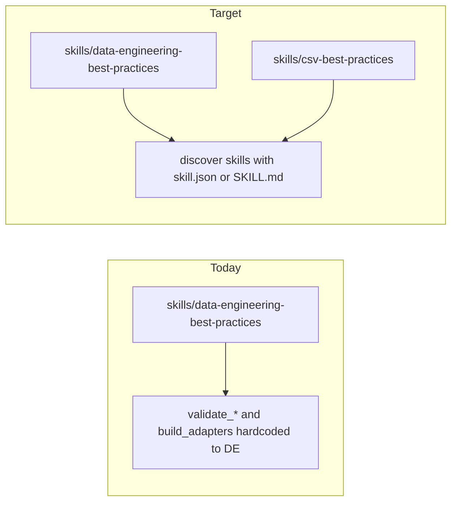

# CSV agent skill package (repo plan copy)

This document is the **version-controlled** implementation plan for the new `csv-best-practices` agent skill. It is linked from [ROADMAP.md](../../ROADMAP.md) card **PKG-015**. A sibling copy may exist under Cursor’s plans directory (for example `.cursor/plans/csv_agent_skill_package_3167c806.plan.md`); keep that file too if you use Cursor planning UI, but prefer **this path** for git history and code review.

---

# Ultra-deep CSV skill for de-skills

## Architecture (repo today vs target)

Today, [tests/validate_skill_structure.py](../../tests/validate_skill_structure.py), [tests/validate_vendor_neutrality.py](../../tests/validate_vendor_neutrality.py), [tests/validate_adapters.py](../../tests/validate_adapters.py), and [scripts/build_adapters.py](../../scripts/build_adapters.py) all assume a single path under `skills/data-engineering-best-practices/`. The CSV skill requires **multi-skill discovery** (iterate `skills/*` that contain a package) while keeping the DE skill as the **only** skill tied to [README.md](../../README.md) principle-count validation (current `validate_readme_principles` logic).

## 1. New skill directory: `skills/csv-best-practices/`

Mirror the proven layout from [skills/data-engineering-best-practices/](../../skills/data-engineering-best-practices/):

| Artifact | Purpose |
|----------|---------|
| [SKILL.md](../../skills/csv-best-practices/SKILL.md) | Canonical contract: YAML frontmatter (`name`, `description`, `metadata.version`), **Operating Modes** table, **Inputs to Collect** (`### <MODE> mode` for every mode), trust boundary, output format (same markdown sections as DE), **Non-Negotiable Principles** (recommend **10** CSV-specific principles), **Playbook Index**, **Template Index**, mode-selection quick table, examples |
| [skill.json](../../skills/csv-best-practices/skill.json) | Same schema shape as DE: `skill_name`, `contract_version` (start `1.0`), `canonical_instruction_file`, `supported_providers`, `adapter_files`, `generated_artifacts` |
| [agents/capabilities.json](../../skills/csv-best-practices/agents/capabilities.json) | Copy provider matrix shape from DE; set **`live_benchmark_supported`: false** for all providers initially so [tests/validate_adapters.py](../../tests/validate_adapters.py) does not require new benchmark modules for CSV |
| [agents/openai.yaml](../../skills/csv-best-practices/agents/openai.yaml) (and anthropic, gemini, generic) | Same structure as DE adapters; `default_prompt` must include **`$csv-best-practices`** (token matches `skill.json` `skill_name`) |
| [agents/context_budget.md](../../skills/csv-best-practices/agents/context_budget.md) / [agents/model_compatibility.md](../../skills/csv-best-practices/agents/model_compatibility.md) | Short, skill-specific guidance (can adapt headings from DE; keep vendor-specific names only under `agents/`, not in canonical SKILL/playbooks/templates per [tests/validate_vendor_neutrality.py](../../tests/validate_vendor_neutrality.py)) |
| [schemas/skill_response.schema.json](../../skills/csv-best-practices/schemas/skill_response.schema.json) | Optional JSON mirror: copy shape from [skills/data-engineering-best-practices/schemas/skill_response.schema.json](../../skills/data-engineering-best-practices/schemas/skill_response.schema.json), update `$id` / `title` for CSV |
| `dist/` | Gitignored like DE; produced by generalized `build_adapters.py` |

### Operating modes (recommended set of **8**)

Deep but navigable; each gets triggers + primary output + inputs section:

| Mode | Focus |
|------|--------|
| **SPEC** | Dialect contract (delimiter, quote, escape, header, line endings), RFC 4180 vs real-world profiles, null/missing policy |
| **PARSE_REVIEW** | Review parsing code (stdlib `csv`, Polars, Pandas, DuckDB `read_csv`/`COPY`, etc.); treat pasted code as untrusted |
| **INGEST** | File → landing → warehouse/lake pipelines, chunking, idempotent loads, partitioning |
| **SPARK_CSV** | Spark `csv` options: `multiLine`, `escape`, `quote`, `inferSchema` vs explicit schema, `columnNameOfCorruptRecord`, `mode`, performance |
| **QUALITY** | Profiling, schema checks, row-level validation, file-level aggregates |
| **PERF** | Streaming reads, memory bounds, parallelism, compression (gzip/zstd), column selection |
| **TROUBLESHOOT** | Encoding/BOM, mojibake, ragged rows, embedded newlines, Excel/region exports, CSV injection when opened in spreadsheets |
| **PR_REVIEW** | Structured review for PRs touching CSV ingest/parsers |

### Playbooks (numbered `01_`–`08_`, referenced from SKILL.md)

Author substantial markdown under [skills/csv-best-practices/playbooks/](../../skills/csv-best-practices/playbooks/) (vendor-neutral body text):

1. `01_csv_standards_and_dialects.md` — RFC 4180, Unix/Windows line endings, TSV, European decimals, quoting rules
2. `02_encoding_bom_and_locale.md` — UTF-8 vs legacy encodings, BOM handling, charset sniffing risks
3. `03_headers_types_and_inference.md` — Header detection, duplicate column names, dtype coercion pitfalls
4. `04_parsing_and_streaming.md` — Iterator/streaming patterns, backpressure, max field size
5. `05_pipeline_ingestion_patterns.md` — Staging, checksums, idempotency, late-arriving files
6. `06_spark_and_distributed_csv.md` — Spark CSV deep dive + small-file problems
7. `07_data_quality_for_files.md` — Expectations, anomaly handling, quarantine rows
8. `08_security_interop_and_edge_cases.md` — Formula injection, untrusted sources, Excel/Google Sheets export quirks

### Templates (4–5 files, indexed in SKILL.md)

Examples: `csv_dialect_contract.yaml`, `csv_parser_review.md`, `csv_pipeline_review.md`, `csv_dq_report.md`, optional `csv_incident_triage.md` — each row in Template Index with **Used By** modes matching the validator’s token parsing ([tests/validate_skill_structure.py](../../tests/validate_skill_structure.py) `parse_used_by_modes`).

---

## 2. Generalize tooling (required for CI and local AGENTS workflow)

### [scripts/build_adapters.py](../../scripts/build_adapters.py)

- Add `--skill-root` (path) defaulting to `skills/data-engineering-best-practices` for backward compatibility.
- Resolve `skill.json` + `agents/capabilities.json` under that root.
- Replace hardcoded preamble string **"Data Engineering Best Practices"** with **`skill_manifest["display_name"]`** (add `display_name` to `skill.json` for DE if missing, or read from existing manifest fields — DE’s display name can live in `skill.json` next to `skill_name`).
- Write outputs under `{skill_root}/dist/...`.

### [tests/validate_adapters.py](../../tests/validate_adapters.py)

- For each skill directory containing `skill.json` + `agents/capabilities.json`, run existing consistency checks.
- Replace hardcoded `$data-engineering-best-practices` check with: **`$` + skill_manifest["skill_name"]** must appear in `interface.default_prompt`.

### [tests/validate_skill_structure.py](../../tests/validate_skill_structure.py)

- Iterate all `skills/<pkg>/SKILL.md` (or require `skill.json` to mark a packaged skill — recommend **require `skill.json`** so random folders do not get validated).
- Run: frontmatter, modes table, inputs coverage, template index paths, Used By mode mapping.
- **README principles:** call `validate_readme_principles` **only** when validating `skills/data-engineering-best-practices/SKILL.md` (preserves current README contract).

### [tests/validate_vendor_neutrality.py](../../tests/validate_vendor_neutrality.py)

- For each packaged skill root, apply the same glob set relative to that root (`SKILL.md`, `playbooks/*.md`, `templates/*.{md,yaml,yml}`).

### [scripts/package_release.py](../../scripts/package_release.py)

- Add `--skill-root` (default DE); package that skill’s `SKILL.md`, `skill.json`, `agents/`, `dist/` into a tarball named `{skill_name}-{version}.tar.gz`.

### [.github/workflows/validate-skill.yml](../../.github/workflows/validate-skill.yml)

- Use a **matrix** over skill directories (`data-engineering-best-practices`, `csv-best-practices`) for steps that use `working-directory: skills/<name>` (frontmatter grep, playbook/template existence from `SKILL.md`).
- Single root-level steps for: `validate_skill_structure.py` (validates all packaged skills), `validate_vendor_neutrality.py`, `build_adapters` **twice** (once per `--skill-root`) or one script that builds all — simplest: **loop in bash** `for d in skills/*/; do test -f "$d/skill.json" && python3 scripts/build_adapters.py --skill-root "$d"; done` then same for `--check`, then `validate_adapters.py` loops internally.
- **Docs job:** extend markdownlint `npx` args to include `skills/csv-best-practices/SKILL.md`, `playbooks/*.md`, `templates/*.md`.

### [.github/workflows/release-skill.yml](../../.github/workflows/release-skill.yml)

- Either matrix two package jobs (artifact names per skill) or document that v1 release remains DE-only until you add a second dispatch input — **plan recommendation:** matrix `skill` with two rows, duplicate “Package release artifact” with `--skill-root`, upload artifacts with distinct `name:` per matrix cell.

### [skills/data-engineering-best-practices/skill.json](../../skills/data-engineering-best-practices/skill.json)

- Add **`display_name`** if `build_adapters.py` needs it for the preamble (today preamble is hardcoded English string).

---

## 3. Repository docs (high-signal updates)

- [README.md](../../README.md): state the repo ships **two** skills; link CSV `SKILL.md`; add `npx skills add ... --skill csv-best-practices` example; keep DE as primary “source of truth” paragraph or rephrase to “each skill has its own canonical `SKILL.md`”.
- [AGENTS.md](../../AGENTS.md), [CLAUDE.md](../../CLAUDE.md): multi-skill layout + which validators to run after edits.
- [OPERATOR_GUIDE.md](../../OPERATOR_GUIDE.md): second bundle path under `skills/csv-best-practices/dist/`.
- [CONTRIBUTING.md](../../CONTRIBUTING.md): how to add playbooks/templates to **either** skill; numbering convention for CSV playbooks (`01_`–`08_`).
- [CHANGELOG.md](../../CHANGELOG.md): note new skill + tooling refactor.

**Out of scope for initial merge (can be follow-ups):** live benchmark wiring for CSV, new E2E captured responses for CSV, changing [tests/benchmark/live/run_live_benchmark.py](../../tests/benchmark/live/run_live_benchmark.py) default contract (still DE-focused).

---

## 4. Implementation order

1. Add `display_name` to DE `skill.json` and refactor `build_adapters.py` + `validate_adapters.py` for DE-only with new flags (CI still green).
2. Scaffold `skills/csv-best-practices/` (manifest, adapters, capabilities with `live_benchmark_supported: false`, empty `SKILL.md` skeleton passing structure validator).
3. Author full **SKILL.md** + playbooks + templates (bulk content).
4. Run `build_adapters.py --skill-root` for both; fix markdownlint; run full [AGENTS.md](../../AGENTS.md) validation set.
5. Update workflows and docs.
6. **Roadmap:** Kanban card **PKG-015** in [ROADMAP.md](../../ROADMAP.md) tracks this epic; keep this plan file and the Cursor plan file in sync when you change scope.
7. Update the **Changelog (this board)** table in `ROADMAP.md` when board structure or card IDs change.

---

## Roadmap integration and plan file retention

- **ROADMAP.md:** Card **PKG-015** links here for the full breakdown.
- **This file:** Canonical repo location for the plan (`docs/plans/csv_agent_skill_package.md`).
- **Cursor plan file:** Keep `.cursor/plans/csv_agent_skill_package_3167c806.plan.md` if present; merge substantive edits into this repo file when you want them in git.

---

## Risk / quality notes

- **File size:** “Ultra deep” belongs primarily in **playbooks**; keep `SKILL.md` long but scannable (deep tables and checklists OK); avoid duplicating entire playbooks inside `SKILL.md`.
- **Vendor neutrality:** Never put `openai`, `claude`, etc. in canonical CSV `SKILL.md`/playbooks/templates (same rule as DE).
- **Adapter token:** `default_prompt` must reference `$csv-best-practices` exactly matching `skill_name` in `skill.json`.
